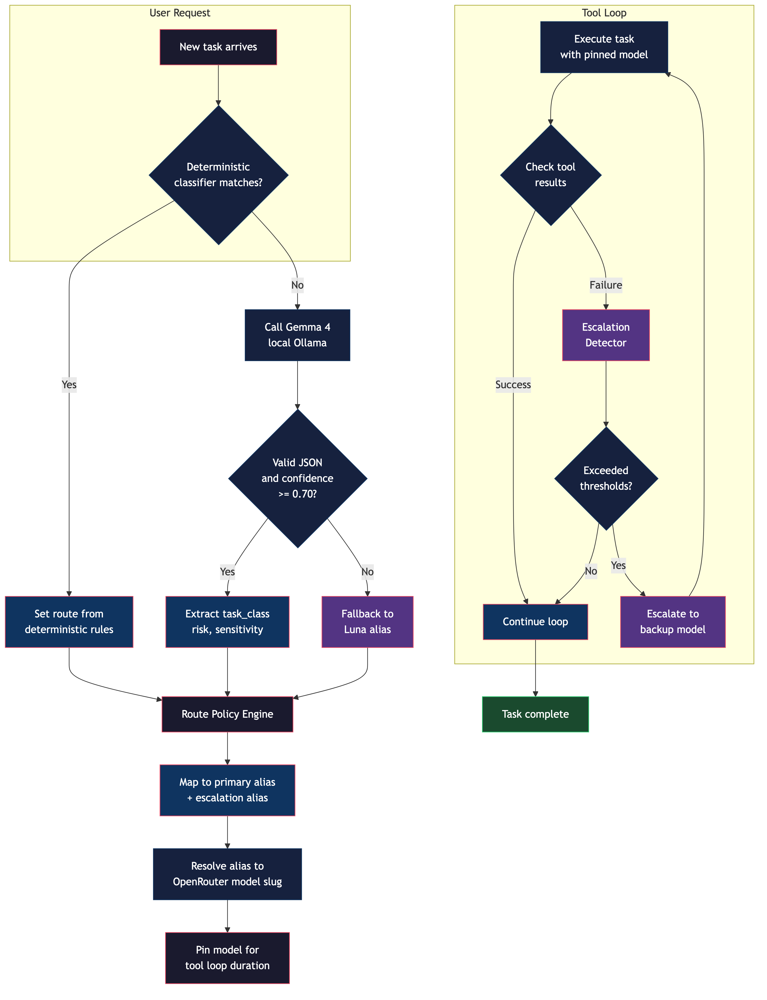

# Hermes Smart Router

A task-aware model routing plugin for [Hermes Agent](https://hermes-agent.nousresearch.com). Exposes one stable virtual model — `tko/smart-router` — that classifies each task using a local Gemma model, selects the optimal OpenRouter model, and pins it through the complete tool loop with automatic escalation when the selected model is failing.

No single model provides the best combination of terminal execution, repository coding, security reasoning, writing, computer use, visual production, latency, and price. Manually changing models is disruptive and unreliable for persistent agents. OpenRouter's automatic router can select models, but it does not enforce a task matrix or escalate after semantic failures such as repeated failed commands or tests.

This plugin keeps Hermes configured to one model while retaining explicit, testable routing policy.

## How it works

```
┌─────────────────────────────────────────────────────────────────────┐
│                        Hermes Agent                                 │
│  model.default: tko/smart-router                                    │
└──────────────────────────┬──────────────────────────────────────────┘
                           │
                           ▼
┌──────────────────────────────────────────────────────────────────────┐
│                    Smart Router Plugin                               │
│                                                              │
│  ┌──────────────┐     ┌──────────────────┐     ┌───────────────┐   │
│  │ Deterministic │────>│   Gemma 4 (local) │────>│  Route Policy │   │
│  │  Classifier   │     │  (Ollama)         │     │  Engine       │   │
│  └──────────────┘     └──────────────────┘     └───────┬───────┘   │
│         │                                               │           │
│         ▼                                               ▼          │
│  ┌──────────────────────────────────────────────────────────────┐   │
│  │                    OpenRouter Transport                       │   │
│  │  Routes to: Luna │ DeepSeek Flash │ GLM-5.2 │ Sol │ Sonnet  │   │
│  │              Opus │ Fable │ Kimi K3 │ Kimi Code               │   │
│  └──────────────────────────────────────────────────────────────┘   │
│                                                              │
│  ┌──────────────────┐     ┌──────────────────┐                    │
│  │  Escalation       │     │  SQLite State    │                    │
│  │  Detector         │<───>│  (task pinning)  │                    │
│  └──────────────────┘     └──────────────────┘                    │
└──────────────────────────────────────────────────────────────────────┘
```

## Routing flowchart



The router follows this decision tree for every new task:

1. **Deterministic classifier** checks for obvious patterns (shell commands, security keywords, GUI control, voice/TTS). If matched, the route is set immediately — no Gemma call needed.
2. **Gemma 4 classifier** (local Ollama) classifies ambiguous tasks into one of eight categories with risk, sensitivity, and confidence scores.
3. **Route policy engine** maps the classification to a primary alias and an escalation alias.
4. **Model pinning** locks the chosen model for the duration of the tool loop.
5. **Escalation detector** monitors tool results for repeated failures, loops, or schema errors and escalates to the backup model when needed.

## Task routing table

| Task class | Primary alias | Escalation alias | Audio capable |
|---|---|---|---|
| Structured/simple extraction | Luna (GPT-5.6) | GLM-5.2 | Yes |
| Agentic execution / CLI | DeepSeek V4 Flash | Sol (GPT-5.6) | No |
| Software engineering | GLM-5.2 | Opus (Claude 5) | No |
| Security engineering / research | Sol (GPT-5.6) | Fable (Claude 5) | Yes |
| Knowledge / research / reasoning | GLM-5.2 | Kimi K3 | No |
| Writing / communication | Sonnet (Claude 5) | Opus (Claude 5) | No |
| GUI / computer use | Sonnet (Claude 5) | Opus (Claude 5) | No |
| Visual / frontend / artifacts | Kimi K3 | Opus (Claude 5) | No |
| Voice / TTS / STT | Luna (GPT-5.6) | Sol (GPT-5.6) | Yes |

## Default model mappings

| Alias | OpenRouter slug | Tools | Vision | Audio |
|---|---|---|---|---|
| `luna` | `openai/gpt-5.6-luna` | Yes | Yes | Yes |
| `sol` | `openai/gpt-5.6-sol` | Yes | Yes | Yes |
| `deepseek_flash` | `deepseek/deepseek-v4-flash-0731` | Yes | No | No |
| `glm` | `z-ai/glm-5.2` | Yes | Yes | No |
| `sonnet` | `anthropic/claude-sonnet-5` | Yes | Yes | No |
| `opus` | `anthropic/claude-opus-5` | Yes | Yes | No |
| `fable` | `anthropic/claude-fable-5` | Yes | Yes | No |
| `kimi_k3` | `moonshotai/kimi-k3` | Yes | Yes | No |
| `kimi_code` | `moonshotai/kimi-k2.7-code` | Yes | No | No |

All slugs are validated against the live OpenRouter model catalog at startup. Missing or renamed slugs produce an unhealthy status rather than a silent failure.

## Operating modes

| Mode | Behavior |
|---|---|
| `active` (default) | Classifies each new session and routes it to the optimal model automatically. |
| `shadow` | Records the route that would have been selected while continuing to use a fixed baseline model. Safe for initial evaluation. |
| `fixed` | Always uses one configured alias while keeping health checks and telemetry enabled. |

Mode is read live from `~/.hermes/config.yaml` — change it and the next request picks it up without restarting Hermes.

## Classification

The local Gemma classifier (default: `gemma4:31b` via Ollama) returns a strict JSON schema:

```json
{
  "task_class": "software_engineering",
  "risk": "low",
  "sensitivity": "public",
  "confidence": 0.95
}
```

Gemma never returns provider names, model names, endpoints, or credentials. The classifier prompt is designed to fit within Gemma's output budget — short, direct, with no extraneous instructions.

If Ollama is unavailable, times out, returns invalid output, or reports confidence below the configurable threshold (default 0.70), the task routes to the Luna alias. The deterministic classifier handles obvious patterns without any external dependency.

## Escalation

Escalation uses observable evidence, not the worker model's self-reported confidence. Default triggers:

- 2+ equivalent failed tool calls
- 2+ nonzero command exits attributable to the same operation
- 2+ repeated test or build failures without material progress
- 2+ response-schema validation failures
- Detected tool-call loop (same tool 3+ times in a row)
- High-risk or destructive operations (start on escalation alias)

## Installation

Two pieces: the Python package (installed into Hermes's venv) and a small plugin shim (so Hermes discovers the provider).

```bash
# 1. Install the package into Hermes's virtualenv
~/.hermes/hermes-agent/venv/bin/pip install hermes-smart-router

# Or from source
git clone https://github.com/KevinOBytes/hermes-smart-router.git
cd hermes-smart-router
~/.hermes/hermes-agent/venv/bin/pip install .

# 2. Create the plugin shim so Hermes discovers the provider
mkdir -p ~/.hermes/plugins/model-providers/smart-router
cat > ~/.hermes/plugins/model-providers/smart-router/__init__.py <<'EOF'
"""Hermes Smart Router — model-provider plugin shim."""
from hermes_smart_router.plugin import SMART_ROUTER_PROFILE  # noqa: F401
EOF
cat > ~/.hermes/plugins/model-providers/smart-router/plugin.yaml <<'EOF'
name: smart-router
kind: model-provider
version: 0.1.0
description: Task-aware model router via local Gemma classification
EOF
```

The import of `hermes_smart_router.plugin` registers the provider automatically. No Hermes core files are modified — the plugin uses only the sanctioned `ProviderProfile` hooks (`prepare_messages` and `build_api_kwargs_extras`) to classify the request and swap the virtual model name for the routed concrete slug.

Auxiliary side-tasks (title generation, context compression, vision fallbacks) never see the virtual model name — the profile pins `default_aux_model` to the cheap structured-output model so Hermes routes those directly.

## Configuration

Add to `~/.hermes/config.yaml`:

```yaml
model:
  default: tko/smart-router
  provider: smart-router
  base_url: https://openrouter.ai/api/v1

# Register the provider name with the Hermes CLI resolver
# (silences "Unknown provider" during setup flows)
providers:
  smart-router:
    name: TKO Smart Router
    api: https://openrouter.ai/api/v1
    key_env: OPENROUTER_API_KEY
    transport: openai_chat

smart_router:
  mode: active  # or shadow, fixed
  ollama:
    model: gemma4:31b
    base_url: http://127.0.0.1:11434
    timeout_seconds: 30
    temperature: 0.0
    max_output_tokens: 512
    confidence_threshold: 0.70
  openrouter:
    base_url: https://openrouter.ai/api/v1
    api_key_env: OPENROUTER_API_KEY
    provider_preferences:
      allow_fallbacks: true
    strict_identity: false
  state:
    path: ~/.hermes/smart-router/state.db
```

Set your OpenRouter API key:

```bash
export OPENROUTER_API_KEY="sk-or-v1-..."
```

## Security

- **No credentials in source**: API keys are read from environment variables at runtime. The `redaction` module strips bearer tokens, API keys, and cookies from all logged data and exception paths.
- **No prompt content in logs**: Telemetry events contain only classifications, aliases, reason codes, counters, timestamps, latency, and usage metadata — never prompts, tool arguments, tool results, or generated text.
- **Classifier cannot select models**: Gemma returns only enum-constrained classification fields. The prompt explicitly forbids returning provider names, model names, endpoints, or credentials.
- **Fail closed**: Unknown classification values, missing model mappings, and unexpected model identity all produce unhealthy status rather than silently routing to an unintended model.
- **Sensitivity-based provider restrictions**: Implemented and tested but disabled by default. When enabled, the configured allowlist overrides normal routing for confidential or restricted tasks.

## Quality gates

- 101+ unit and integration tests
- Ruff linting (strict)
- Mypy type checking (strict)
- Wheel build and clean-environment installation
- Hermes plugin discovery and registration
- Fixture-based routing accuracy evaluation (86.7%+ correct alias routing)
- Live catalog validation against OpenRouter API
- Log and SQLite secret/content leakage checks

## License

MIT

## Author

Kevin O'Connor — [kevinbytes.com](https://kevinbytes.com)
